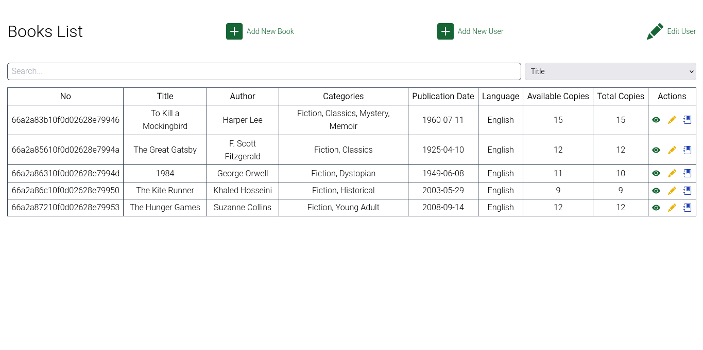
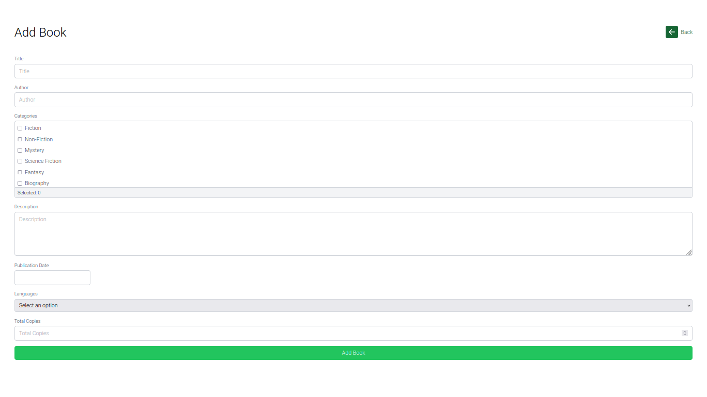
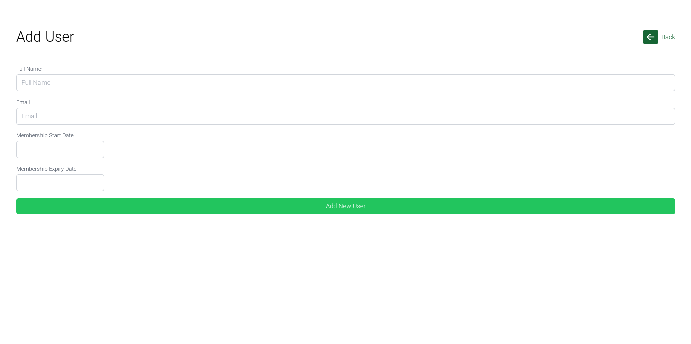
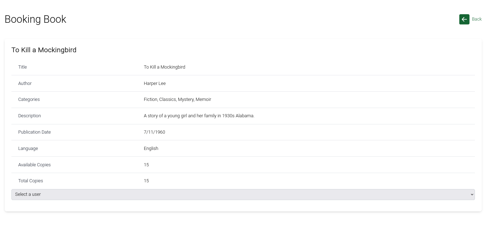
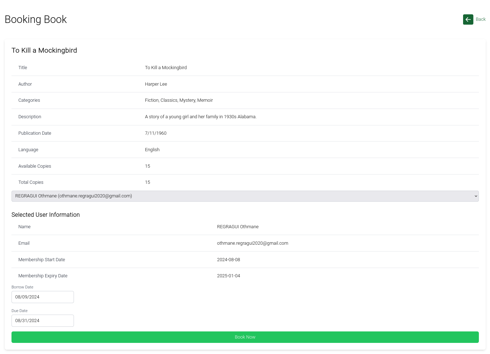
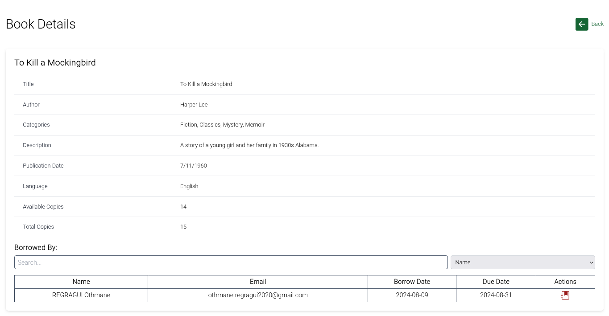
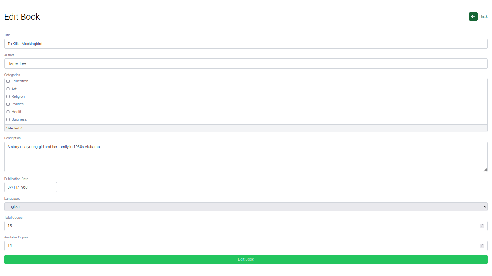
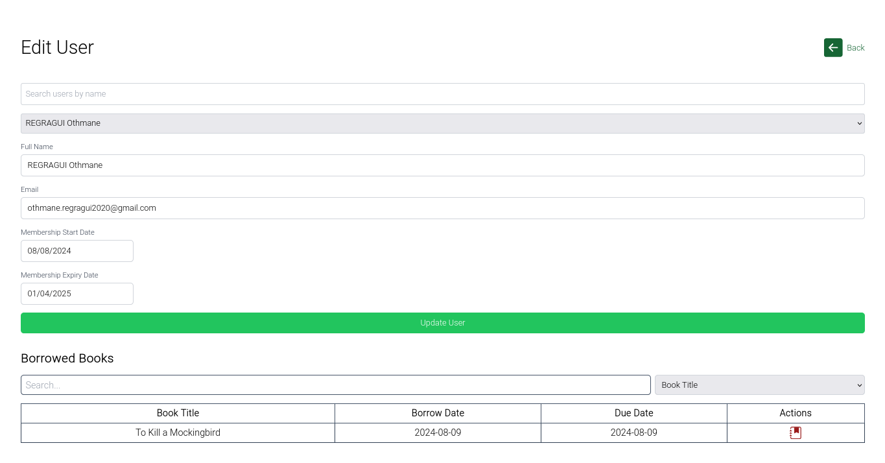

# E-Library

E-Library is a web application that allows user to manage an online library. The project is divided into a backend and a frontend, built using `MERN`.



### Backend

- Node.js
- Express.js
- MongoDB (with Mongoose)
- JWT (for authentication)
- Config file: `config.js`
  - `PORT`: The port number for the backend server (default: 5555)
  - `mongoDBURL`: The connection string for the MongoDB database
  - `frontendURL`: The URL for the frontend application (default: `http://localhost:5173`)

### Frontend

- React.js
- Vite (for building the app)
- Tailwind CSS (for styling)
- React Router (for routing)
- Axios (for making API requests)
- Config file: `config.js`
  - `backEndUrl`: The URL for the backend server (default: `http://localhost:5555`)

## Installation

### Backend

1. Navigate to the `backend` directory.
2. Run `npm install` to install the required dependencies.
3. Edit `config.js` file in the `backend` directory and add the following configuration:
   ```javascript
   export const PORT = 5555;
   export const mongoDBURL = "mongodb://127.0.0.1:27017/E-Library";
   export const frontendURL = "http://localhost:5173";
   ```
4. Run `npm start` to start the backend server.

### Frontend

1. Navigate to the `frontend` directory.
2. Run `npm install` to install the required dependencies.
3. Edit `config.js` file in the `backend` directory and add the following configuration:
   ```javascript
   export const backEndUrl = "http://localhost:5555";
   ```
4. Run `npm start` to start the backend server.

### Contributing

If you would like to contribute to the E-Library project, please follow these steps:

1. Fork the repository.
2. Create a new branch for your feature or bug fix.
3. Make your changes and commit them.
4. Push your changes to your fork.
5. Submit a pull request to the main repository.

### Thanks

We would like to express our gratitude to the open-source community for providing the tools and libraries used in this project. Your contributions have been invaluable in making this project possible.








